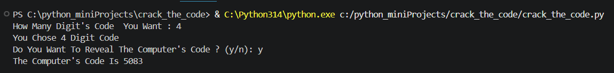
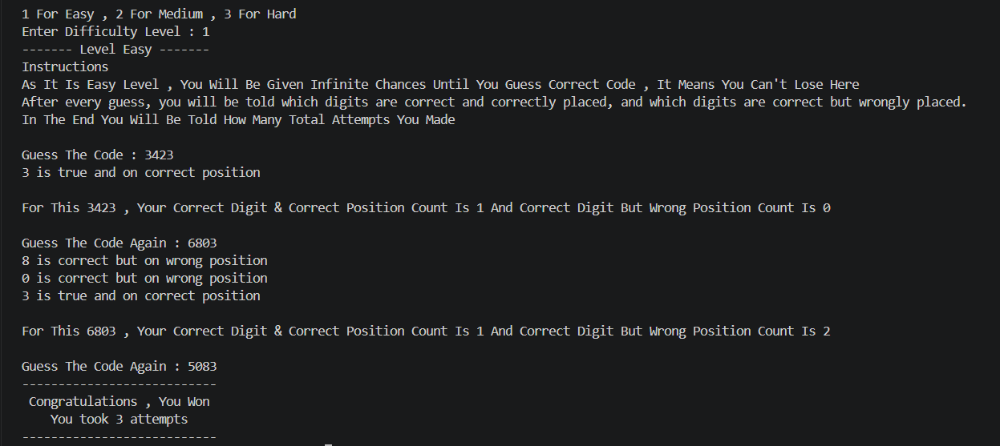
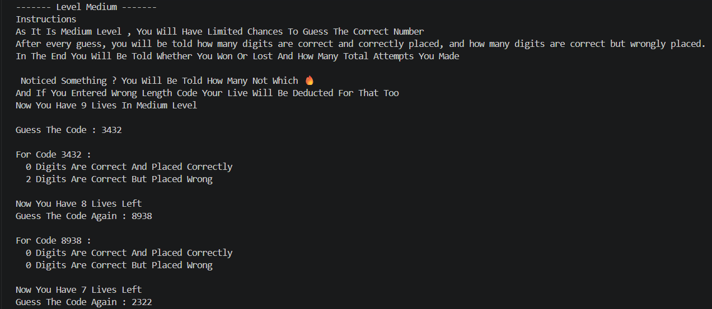
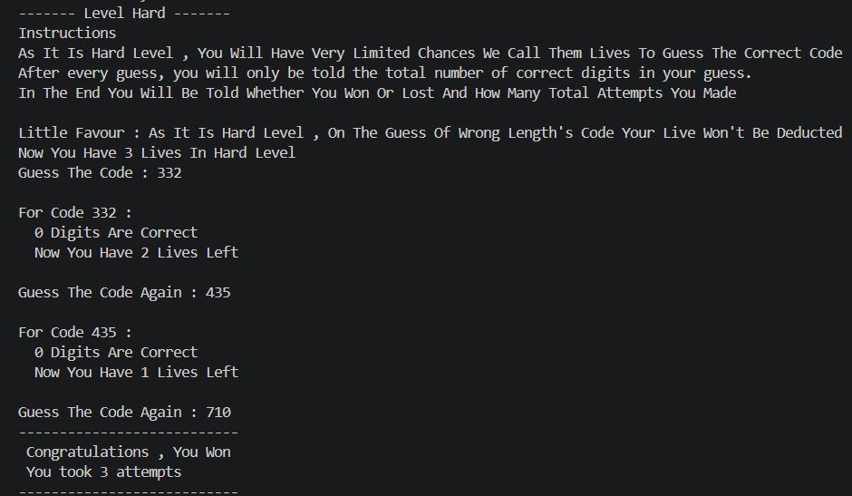
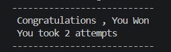

# 🔐 Crack The Code


<p align="center">
    
</p>


> A Python-based code-cracking game with three difficulty levels, Cheat Mode, lives, attempt tracking, and intelligent digit feedback

---

## 🎮 About The Game

**Crack The Code** is a beginner-friendly Python console game where the computer generates a secret code based on the number of digits selected by the player.

Before starting the game, the player chooses:

1. 🔢 The number of digits in the secret code
2. 🕵️ Whether to enable **Cheat Mode**
3. 🎯 The desired difficulty level

---

## ✨ Features

- 🔢 Custom secret code length
- 🎲 Random secret code generation
- 🕵️ Optional **Cheat Mode**
- 🎮 Three difficulty levels
- ♾️ Unlimited attempts in Easy Mode
- ❤️ Limited lives in Medium and Hard Mode
- 🎯 Correct-position feedback
- 🔄 Wrong-position digit detection
- 📊 Attempt tracking
- ✅ Input length validation
- 💻 Runs directly in the Python console

---

## 🔄 How The Game Works

### 1️⃣ Choose Code Length

The game first asks how many digits the secret code should contain.

For example:

```text
How Many Digit Number You Want : 4
You Chose 4 Digit Number
```
The computer then randomly generates a 4-digit secret code.

---

### 2️⃣ Cheat Mode

Before guessing begins, the player can decide whether to reveal the computer's secret code.

```
Do You Want To Reveal The Computer's Number? (y/n):
```

- `y` → Reveals the secret code
- `n` → Keeps the code hidden
- Any other input → The code remains hidden

This feature is called **Cheat Mode**.

---

### 3️⃣ Choose Difficulty

The player can choose between three difficulty levels:

```
1 For Easy
2 For Medium
3 For Hard
```

Each level provides different rules and feedback.

---

## 📸 Screenshots

### 🎮 Game Start


### 🟢 Easy Mode



### 🟡 Medium Mode



### 🔴 Hard Mode



### 🏆 Winning Screen



---

## 📊 Difficulty Levels And Comparison

|Feature|🟢 Easy|🟡 Medium|🔴 Hard|
|---|---|---|---|
|Lives|♾️ Unlimited|❤️ 9|❤️ 3|
|Correct digits revealed|✅|🔢 Count only|🔢 Count only|
|Correct position revealed|✅|✅ Count only|❌|
|Wrong-position information|✅|❌|❌|
|Wrong-length guess costs life|❌|✅|❌|
|Attempt tracking|✅|✅|✅|

---

## 🧠 Python Concepts Used

This project was built to practice and apply fundamental Python programming concepts.

🔹 **Variables:** Used to store values such as the secret code, guesses, lives, attempts, and digit counts. <br>
🔹 **User Input:** `input()` is used to interact with the player and receive guesses and game choices. <br>
🔹 **Type Casting:** `int()` is used to convert numerical user input from string to integer. <br>
🔹 **Conditional Statements:** `if`, `elif`, and `else` control game decisions, difficulty levels, and validation. <br>
🔹 **Functions:** Separate functions are used for each difficulty level: `level_easy()` • `level_medium()` • `level_hard()`. <br>
🔹 **While Loops:** Used for repeated guessing, input validation, lives, and gameplay. <br>
🔹 **For Loops:** Used to compare individual digits of the user's guess with the secret code. <br>
🔹 **Lists:** Used for digit comparison and tracking already matched digits. <br>
🔹 **List Comprehension:** Used to efficiently create a list of correctly matched digits. <br>
🔹 **String Operations:** Strings are used to handle and compare the secret code and user guesses. Examples: `len()`, indexing, `in`, `.count()`, `.lower()`. <br>
🔹 **Random Number Generation:** Python's built-in `random` module is used to generate the secret code using `random.randint()`. <br>
🔹 **Counters:** Used to track attempts, correct digits, and wrong-position digits. <br>
🔹 **Boolean Conditions:** Boolean expressions are used to compare guesses and control program flow. <br>
🔹 **Exception Handling:** `try` and `except` handle invalid numerical input and prevent the program from crashing. <br>
🔹 **Program Flow Control:** The project combines **conditions, loops, functions, validation, and exception handling** to create a complete interactive console game.

---

## 🛠️ Technologies & Requirements

### Python Module
- `random` — Used for generating the secret code.
> `random` is part of Python's standard library, so no separate installation is required.

### Requirements

- **Python 3.x**
- Any Python-compatible IDE or code editor

You can use:

- Visual Studio Code
- PyCharm
- IDLE
- Any other Python IDE/editor

No external Python packages are required.

---

## 🚀 How To Run

### Option 1 — Run In An IDE

1. Open the `crack_the_code` project folder.
2. Open the Python source file.
3. Make sure Python 3.x is installed.
4. Run the Python file.
5. Follow the instructions shown in the console.

### Option 2 — Run From Terminal

Open the project folder in a terminal and run the Python file using:

```
python filename.py
```

On some systems, you may need:

```
python3 filename.py
```

---

## 📂 Project Structure

```
crack_the_code/
│
├── crack_the_code.py
├── README.md
└── screenshots/
    ├── game_start.png
    ├── easy_mode.png
    ├── medium_mode.png
    ├── hard_mode.png
    └── winning_screen.png
```

---

## 🎯 Learning Objectives

This project was created to strengthen practical understanding of beginner-level Python programming.

Through this project, the following concepts were practiced:

- Writing and calling functions
- Working with user input
- Using loops for repeated actions
- Applying conditional logic
- Working with strings and lists
- Generating random values
- Tracking game state using variables
- Implementing lives and attempt systems
- Validating user input
- Handling exceptions
- Designing a multi-level console game

---
## 👨‍💻 Author

**Malik Waleed Hussain**

**Data Analytics / Computer Science Student**

GitHub: **@waleed4we**

---

**Crack The Code** is part of my **Python Mini Projects** collection, created to practice Python programming through small, practical, and interactive projects.
